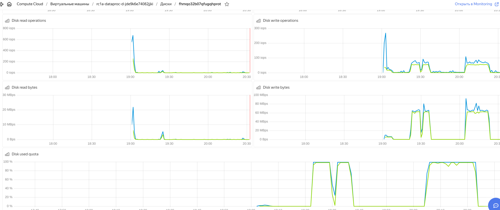
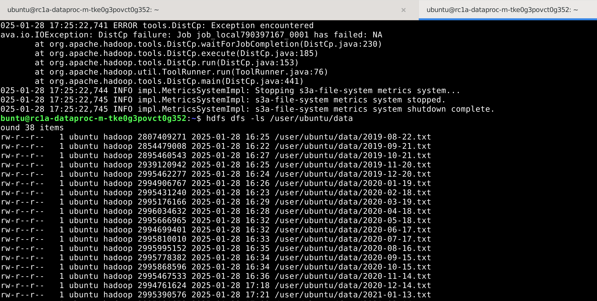

# Инфраструктура 

Разворачивается с помощью Terraform в облаке Yandex.


### 1. Создание нового bucket

Смотри описание ресурса ```resource "yandex_storage_bucket" "data_bucket"``` в [main.tf](terraform/main.tf)

Создать инфрастуктуру (втч bucket)
```bash
make tf_apply
```

После создания бакет доступен по адресу s3://aresh2025-bucket-b1gdo3s8323p2nfiiqgl или https://storage.yandexcloud.net/aresh2025-bucket-b1gdo3s8323p2nfiiqgl/

### 2. Копирование из s3://otus-mlops-source-data/ в новый bucket

#### Способ вручную

```bash
# Устанавливаем s3cmd
sudo apt-get install -y s3cmd
```

```bash
# Настраиваем s3cmd

cat <<EOF > ~/.s3cfg
[default]
access_key = ${access_key}
secret_key = ${secret_key}
host_base = storage.yandexcloud.net
use_https = True
EOF
```

Значения `access_key` и `secret_key` берем из [terraform.tfstate](terraform/terraform.tfstate) после применения ```make tf_apply```

```bash
# Копируем
TARGET_BUCKET=aresh2025-bucket-b1gdo3s8323p2nfiiqgl
s3cmd sync --acl-public  s3://otus-mlops-source-data/ s3://$TARGET_BUCKET/
```

Желательно выполнить на каком-то хосте в облаке, чтобы копирование файлов шло внутри облака (быстрее).

### 3. Создание Spark-кластера

Описан в [main.tf](terraform/main.tf)

### 4. Копирование содержимого хранилища в файловую систему HDFS

```ssh
ssh -l ubuntu 158.160.38.21
```
IP динамический, смотреть в консоли облака

```bash
# Создаем директорию в HDFS
hdfs dfs -mkdir -p /user/ubuntu/data
```


```bash
# Копируем все данные
s3_bucket=aresh2025-bucket-b1gdo3s8323p2nfiiqgl
hadoop distcp s3a://$s3_bucket/ /user/ubuntu/data
```


```bash
# Выводим содержимое директории для проверки
hdfs dfs -ls /user/ubuntu/data
```


Если перезапускать операцию несколько раз, то можно столкнуться с нехваткой места на диске.
В одном случае у меня скопировалось 38 файлов из 40. (перезапускал копирование)

```
Caused by: java.io.IOException: Couldn't run retriable-command: Copying s3a://aresh2025-bucket-b1gdo3s8323p2nfiiqgl/2021-12-09.txt to hdfs://rc1a-dataproc-m-tke0g3povct0g352.mdb.yandexcloud.net/user/ubuntu/data/2021-12-09.txt
	at org.apache.hadoop.tools.util.RetriableCommand.execute(RetriableCommand.java:101)
	at org.apache.hadoop.tools.mapred.CopyMapper.copyFileWithRetry(CopyMapper.java:258)
	... 11 more
Caused by: org.apache.hadoop.ipc.RemoteException(java.io.IOException): File /user/ubuntu/data/.distcp.tmp.attempt_local790397167_0001_m_000000_0.1738085122124 could only be written to 0 of the 1 minReplication nodes. There are 1 datanode(s) running and 1 node(s) are excluded in this operation.
	at org.apache.hadoop.hdfs.server.blockmanagement.BlockManager.chooseTarget4NewBlock(BlockManager.java:2278)
	at org.apache.hadoop.hdfs.server.namenode.FSDirWriteFileOp.chooseTargetForNewBlock(FSDirWriteFileOp.java:294)
	at org.apache.hadoop.hdfs.server.namenode.FSNamesystem.getAdditionalBlock(FSNamesystem.java:2808)
	at org.apache.hadoop.hdfs.server.namenode.NameNodeRpcServer.addBlock(NameNodeRpcServer.java:905)


```



