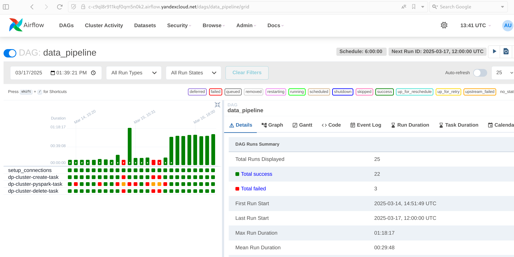
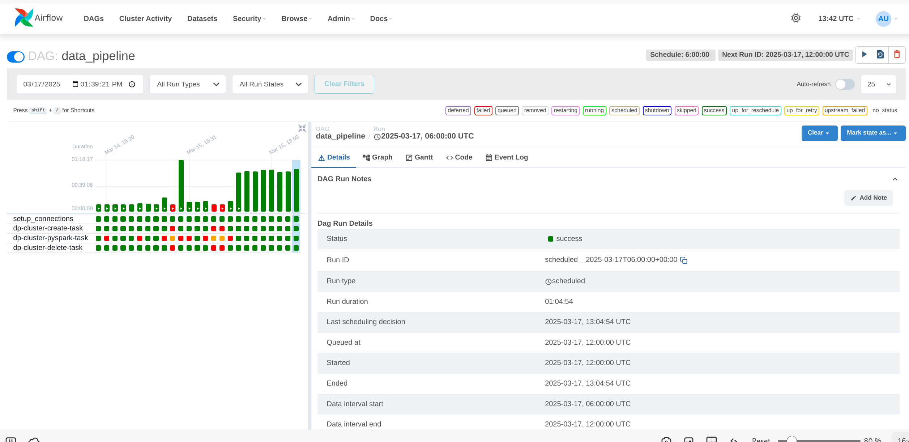

# Предварительная обработка данных по расписанию в Apache Airflow и временном кластере Spark

1. Создать инфраструктуру с помощью [infra](../infra)
2. Сконфигурировать Apache Airflow c помощью [variables.json](../infra/variables.json)
3. Залить DAG `make upload-dags-to-bucket`
4. Залить исходные данные. Либо из [input_data](input_data) с помощью  `make upload-data-to-bucket`. Либо командой

```bash
TARGET_BUCKET=airflow-bucket-rezawq-f5957cd9f7414256
s3cmd cp \
    --config=/home/ubuntu/.s3cfg \
    --acl-public \
    s3://otus-mlops-source-data/*.txt \
    s3://$TARGET_BUCKET/input_data/
```

5. Залить исходный код скрипта обработки [pyspark_script.py](src/pyspark_script.py) с помощью
   `make upload-src-to-bucket`
6. Запустить DAG в Airflowили дождаться запуска по расписанию
7. Скачать обработанные файлы на диск `make download-output-data-from-bucket`

## Скриншоты

## Airflow


## Airflow last DAG



