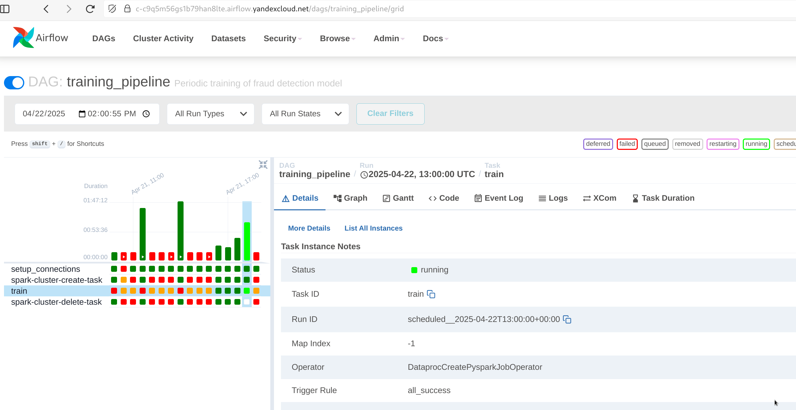
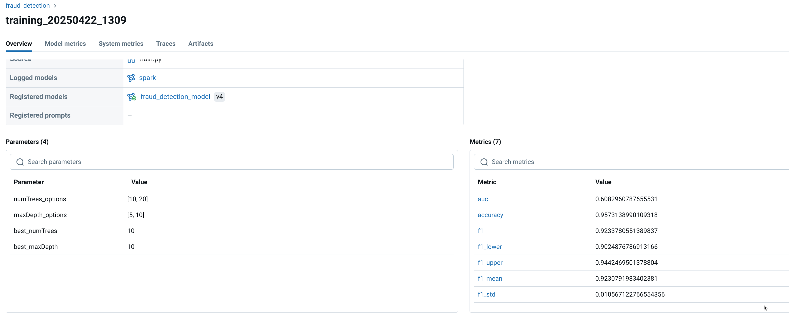

# Проделанная работа

По сравнению с предидущим заданием изменена логика работы.
Для метрики f1 расчитывается её распределение методом bootstrap, определяются доверительные интервалы.

Для новой модели определяется, что её средняя метрика f1 больше чем границы доверительного интервала для предидущей лучшей метрики.

```python
      if new_metrics["f1"] > best_metrics["f1_upper"]:
            should_promote = True
            improvement = (new_metrics["f1"] - best_metrics["f1"]) / best_metrics["f1"] * 100
            print(
                f"Новая модель лучше на {improvement:.2f}% по f1. Установка в качестве 'champion'"
            )
        else:
            print(
                f"Новая модель не превосходит текущую 'champion' модель по f1. "
                f"Верхняя оценка для текущего f1: {best_metrics['f1_upper']:.4f}, новый f1: {new_metrics['f1']:.4f}"
            )
```

## Cкриншот Airflow 





## Cкриншот MlFlow

